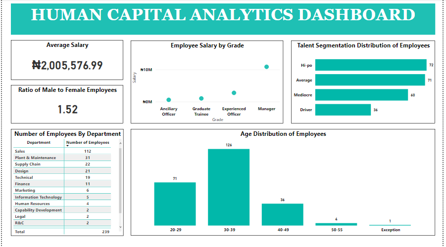
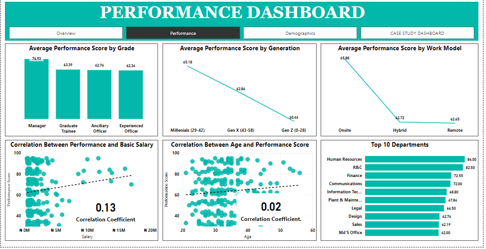

# HUMAN RESOURCES ANALYTICS-PROJECTS

## INTRODUCTION
This presentation delves into a compelling Case Study featuring a dataset containing details regarding an organization's workforce. Upon an in-depth examination of this dataset, it becomes evident that a multitude of critical metrics can be harnessed to yield invaluable insights. The significance of this analysis cannot be overstated; its findings are poised to empower stakeholders, management, and the Human Capital team with the knowledge required to make well-informed decisions. 
By conducting an exploratory analysis on the dataset and leveraging an intuitive dashboard, I have distilled the data into easily comprehensible insights, facilitating the path to sound decision-making and answering important questions sked in the case study.

## PROBLEM / QUESTIONS
The stakeholders need answers to the following question :
1. What is the Age distribution of the employees?
2. Ratio of male to female employees
3. Department with the highest number of employees
4. The Average Salary of an employee
5. Univariate analysis on talent segmentation
6. Bivariate analysis: company salaries to grade

## SOLUTIONS / ANSWERS TO STAKEHOLDERS QUESTIONS

## INSIGHTS FROM ANSWERS
- Employees within the Age bracket of 30 to 39 constitute the highest number in terms of the workforce population with a consistent decline in the number of employees in age groups beyond 30 to 39.
- The ratio of Male to Female stands at 1.52 signifying that the male workforce outnumbers the female workforce by 48%.
- The Sales department has the highest employee count, totaling 112 individuals.
- The Average Salary is Two million, five thousand, five hundred seventy-six naira and ninety-nine kobo (naira is used as the currency placeholder until the real currency is given).
- Among the Talent segments, High Potential (Hi-Po) employees hold the largest share, while the Driver category has the smallest.
- The scatter plot illustrates a clear positive relationship between employees' career progression in terms of grade and their corresponding salary. The upward direction of the data points on the plot validates this positive relationship between grade and salary.

# EXTRA DASHBOARDS & INSIGHTS

## INSIGHTS FROM THE EXTRA DASHBOARDS

- The organization faces challenges retaining employees beyond 14 years LOS (Length of Stay). This results in brain drain and experience loss to other organizations.
- The majority of employees in the dataset are typically hired in January and March.
- The workforce has about 64 out of 100 average performance score with HR, R&C, and Finance leading as top 3 performers.
- The average age suggests a millennial population. The top and bottom charts validates this with the millennial generation dominating the employees’ ages brackets.
- Low correlation coefficients (0.13 & 0.02) indicate Salary and Age have no significant influence on Performance.
- The workforce lacks gender diversity as the share of male is greater than female in terms of workforce population.
- Managers perform best as compared to other grades of employees.
- Onsite work has a positive impact on performance than other work model.
- The millennial generation dominates good performance in the organization which makes the Average Age of the workforce healthy for the organization.
